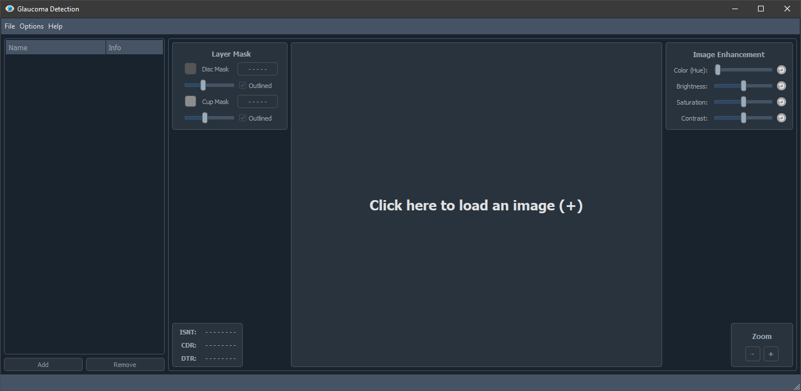
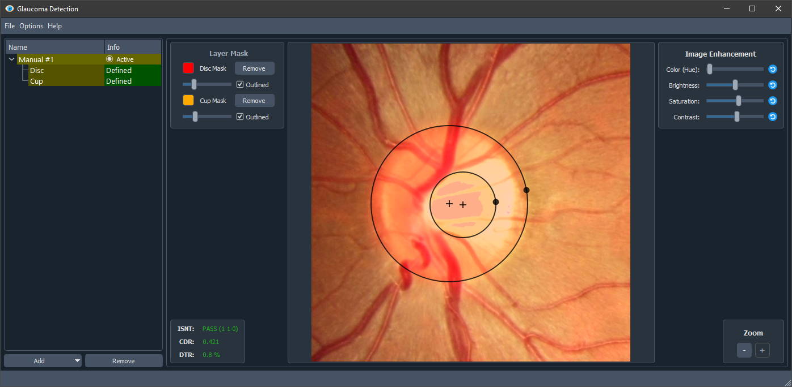
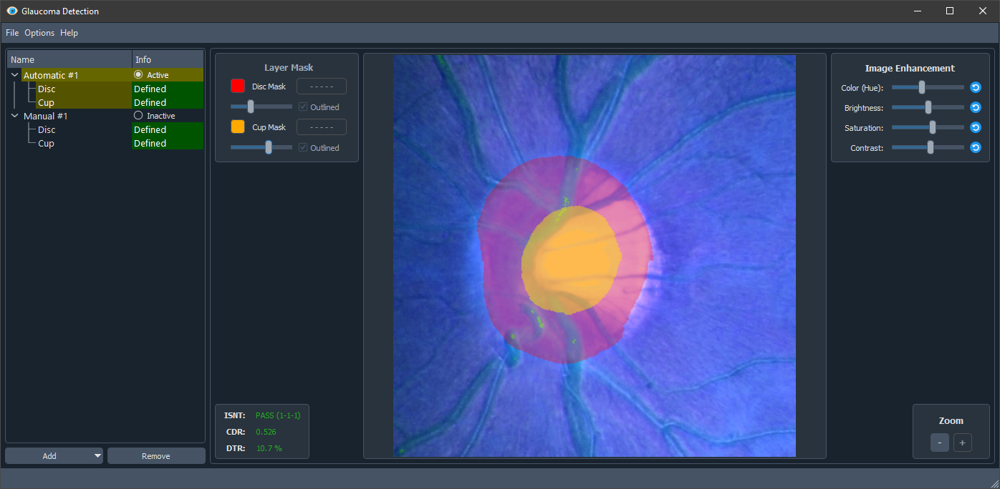
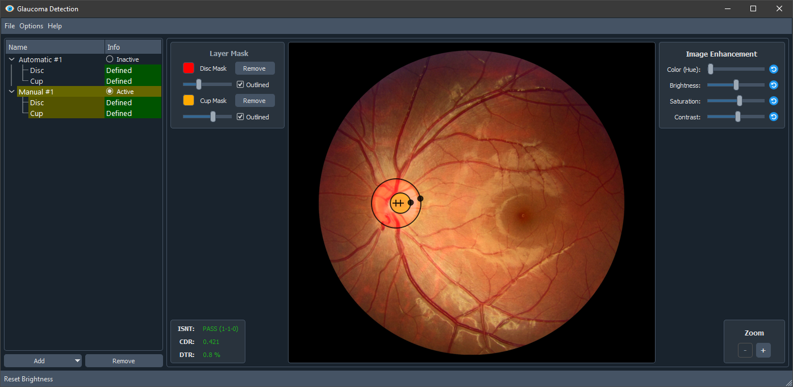

# glaucoma-detection
Python GUI to detect Glaucoma in fundus images 

# Startup

# Manual Mask

# Automatic Mask

# Layers

The app can have as many different layers

TODO:
  1. Save/Load projects
  2. Add Ellipse instead of circle to get accurate results
  3. Add automatic layer interpolation (circular and elliptical)
  4. Add different MNET approaches to have variety in results
